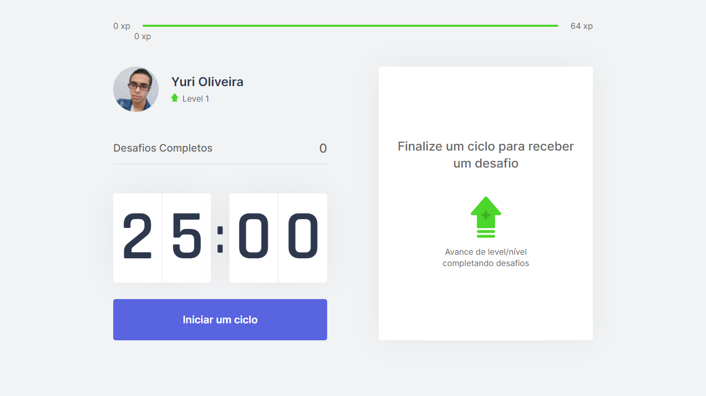

<h1 align="center">
    <br>
        
    <br><br>
        MoveIt 
</h1>

<div>
    <p align="center">
        MoveIt is a project developed during the 4th edition of Rocketseat's Next Level Week. This week we created a web app using React, after 25 minutes of study, it sends us an alert with some exercises for the body and eyes, with level advancement for each challenge performed.
    </p>
</div>
<div>

<p align="center">
    <a href="https://www.linkedin.com/in/yuri-silva99/" target="_blank">
        
    </a>
    <a href="#">
        
    </a>
    <a href="#">
        
    </a>
    <a href="#">
        
    </a>
</p>

</div>

## Features

- ⏲️ Start a 25-minute study period.
- ❌ Abandon study periods.
- 🔊 Notification and audible warning when the period ends.
- 👀 New challenges to exercise your eyes and body.
- 🎮 User earns XP for every challenge completed.
- 🆙 Stay motivated after each level as you advance.

## Exploited Concepts / Technologies

- ReactJS
- Typescript
- NextJS

## Get Started
<b> You must have already installed </b>
- <a href="https://nodejs.org/en/download/"> Node.JS </a>
- Package manager (NPM or Yarn)

<b> Recommendations </b>

<ul>
    <li> It is recommended that you have installed Google Chrome </li>
    <li> I recommend using VSCode as a development IDE </li>
</ul>

``` bash
## Clone the repository
$ git clone https://github.com/Yuri-stack/NLW4_MoveIt

## Access the project folder at the command prompt
$ cd moveit

## Install the dependencies
yarn install
or
$ npm install

## Getting Started
$ yarn start
or
$ npm run start
```
## Translations
<ul>
    <li><a href="https://github.com/Yuri-stack/NLW4_MoveIt/blob/main/ReadMe.md">Original</a></li>
    <li><a href="github/translate/ReadMe.md">Portuguese</a></li>
</ul>

## License

Released in 2021. This project is under the MIT license.
Made with care and love by Yuri Oliveira 🚀.
